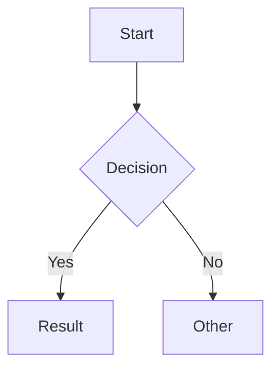

# Markdown + Mermaid Renderer

A React SPA for rendering Markdown with inline Mermaid diagram support. Features a split-pane editor with live preview and PDF export capability.

## Features

- GitHub Flavored Markdown (GFM) support
- Inline Mermaid diagram rendering
- Multiple rendering options via [beautiful-mermaid](https://github.com/lukilabs/beautiful-mermaid):
  - Default (mermaid.js) - standard SVG rendering
  - Beautiful Mermaid SVG - styled SVG output
  - Beautiful Mermaid ASCII - terminal-friendly text output
- Live preview with split-pane editor
- Open preview in separate tab for PDF export
- Copy preview to clipboard for pasting into Outlook, Word, and Confluence (SVG diagrams are converted to PNG images for compatibility)
- Render mode persisted to localStorage
- Print-friendly styling

## Getting Started

```bash
# Install dependencies
pnpm install

# Start development server
pnpm dev

# Build for production
pnpm build
```

## Usage

1. Write Markdown in the left editor pane
2. See live preview in the right pane
3. Use fenced code blocks with `mermaid` language for diagrams:

````markdown

````

4. Select a rendering mode from the "Renderer" dropdown in the header
5. When using a Beautiful Mermaid mode, click "Theme" to customize diagram colors and fonts
6. Click "Copy" in the preview pane header to copy the rendered content (including diagrams as images) to your clipboard, then paste into Outlook, Word, or Confluence
7. Click the `▾` toggle next to Copy to choose a diagram conversion strategy (Auto, SVG, or DOM)
8. Click "New Tab" to open a standalone preview for PDF export via browser print

## How Copy Preview Works

Outlook, Word, and Confluence don't render inline SVGs from clipboard HTML, so the copy feature converts Mermaid diagrams to PNG images before writing to the clipboard. Three conversion strategies are available:

- **Auto** (default) — tries SVG pipeline first, falls back to DOM capture on failure
- **SVG (fast)** — serializes SVG to XML, strips `<foreignObject>` elements (replacing with `<text>`), draws onto a `<canvas>`, and exports as PNG. Fast but approximate for flowcharts that use foreignObject for text labels.
- **DOM (pixel-perfect)** — uses `html2canvas` to render the diagram container directly from the DOM. Slower but captures exactly what you see on screen, including custom themes.

In all strategies:

1. The preview DOM is cloned so the page is never modified
2. Diagrams are converted to PNG at 2x resolution (retina clarity), capped at 600px wide
3. Critical CSS (fonts, colors, borders, table styling) is inlined since clipboard HTML has no stylesheet
4. The result is written to the clipboard as both `text/html` (for rich paste) and `text/plain` (for plain text editors) using `navigator.clipboard.write()`

## Dependencies

| Package | Purpose |
|---------|---------|
| **react** | UI framework for building the component-based interface |
| **react-dom** | React renderer for web browsers |
| **react-markdown** | Converts Markdown strings into React components |
| **remark-gfm** | Plugin for react-markdown that adds GitHub Flavored Markdown support (tables, strikethrough, task lists, etc.) |
| **rehype-raw** | Plugin that allows raw HTML embedded in Markdown to pass through |
| **mermaid** | Renders diagram definitions (flowcharts, sequence diagrams, etc.) into SVG |
| **beautiful-mermaid** | Alternative mermaid renderer with SVG and ASCII output options |
| **html2canvas** | Renders DOM elements to canvas for pixel-perfect diagram-to-PNG conversion |

### Dev Dependencies

| Package | Purpose |
|---------|---------|
| **vite** | Fast build tool and dev server with HMR |
| **typescript** | Type checking for JavaScript |
| **@vitejs/plugin-react** | Vite plugin for React Fast Refresh |
| **eslint** | Code linting |
