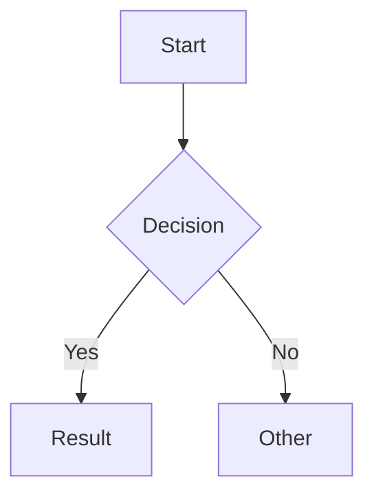

# Markdown + Mermaid Renderer

A React SPA for rendering Markdown with inline Mermaid diagram support. Features a split-pane editor with live preview and PDF export capability.

## Features

- GitHub Flavored Markdown (GFM) support
- Inline Mermaid diagram rendering
- Live preview with split-pane editor
- Open preview in separate tab for PDF export
- Print-friendly styling

## Getting Started

```bash
# Install dependencies
pnpm install

# Start development server
pnpm dev

# Build for production
pnpm build
```

## Usage

1. Write Markdown in the left editor pane
2. See live preview in the right pane
3. Use fenced code blocks with `mermaid` language for diagrams:

````markdown

````

4. Click "Open Preview in New Tab" to export as PDF via browser print

## Dependencies

| Package | Purpose |
|---------|---------|
| **react** | UI framework for building the component-based interface |
| **react-dom** | React renderer for web browsers |
| **react-markdown** | Converts Markdown strings into React components |
| **remark-gfm** | Plugin for react-markdown that adds GitHub Flavored Markdown support (tables, strikethrough, task lists, etc.) |
| **rehype-raw** | Plugin that allows raw HTML embedded in Markdown to pass through |
| **mermaid** | Renders diagram definitions (flowcharts, sequence diagrams, etc.) into SVG |

### Dev Dependencies

| Package | Purpose |
|---------|---------|
| **vite** | Fast build tool and dev server with HMR |
| **typescript** | Type checking for JavaScript |
| **@vitejs/plugin-react** | Vite plugin for React Fast Refresh |
| **eslint** | Code linting |
