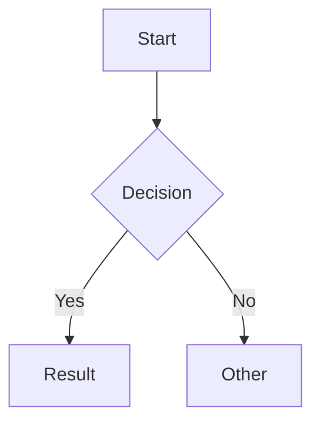

# Markdown + Mermaid Renderer

A React SPA for rendering Markdown with inline Mermaid diagram support. Features a split-pane editor with live preview and PDF export capability.

## Features

- GitHub Flavored Markdown (GFM) support
- Inline Mermaid diagram rendering
- Live preview with split-pane editor
- Open preview in separate tab for PDF export
- Print-friendly styling

## Getting Started

```bash
# Install dependencies
pnpm install

# Start development server
pnpm dev

# Build for production
pnpm build
```

## Usage

1. Write Markdown in the left editor pane
2. See live preview in the right pane
3. Use fenced code blocks with `mermaid` language for diagrams:

````markdown

````

4. Click "Open Preview in New Tab" to export as PDF via browser print

## Tech Stack

- React 19 + TypeScript
- Vite
- react-markdown + remark-gfm
- Mermaid
